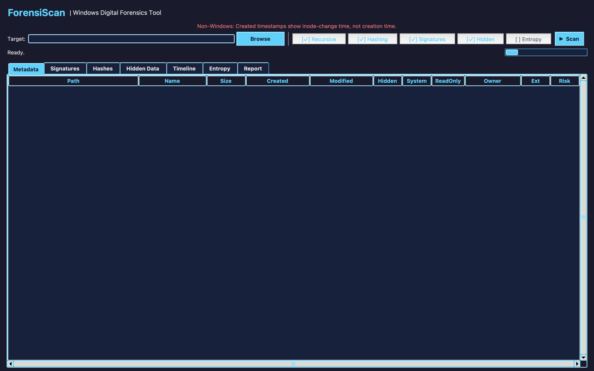

# ForensiScan

ForensiScan is a Python desktop application for read-only file-system triage and digital-forensic analysis. It provides a graphical interface for collecting file metadata, calculating cryptographic hashes, checking file signatures, identifying suspicious file attributes and NTFS alternate data streams, analysing Shannon entropy, constructing MAC timelines, and exporting investigation results.

The application is designed primarily for Windows systems. Core analysis functions can run on other operating systems, but Windows-specific evidence such as NTFS alternate data streams, Windows file attributes, and owner information is limited or unavailable outside Windows.

## Features

- File-system metadata collection, including file size, timestamps, extension, owner, and Windows attributes.
- Recursive or non-recursive directory scanning.
- MD5, SHA-1, and SHA-256 hashing in a single file pass.
- Duplicate-file identification using calculated hashes.
- Matching against investigator-supplied MD5 or SHA-256 hash sets.
- Magic-byte file-signature verification to identify extension/type mismatches.
- NTFS alternate data stream detection on Windows.
- Suspicion heuristics for hidden/system attributes, double extensions, risky executable locations, zero-byte executables, and unusually large text files.
- Composite risk scoring from multiple forensic indicators.
- Shannon entropy analysis for identifying files that may be encrypted, packed, or compressed.
- Chronological MAC timeline construction using created and modified timestamps, with optional access-time events.
- Timestamp-anomaly detection for files whose modified timestamp predates their creation timestamp.
- Sortable graphical result tables for rapid triage.
- CSV bundle export for structured analysis.
- HTML forensic report generation.
- PDF forensic report generation using ReportLab.

## Project Structure

```text
ForensiScan/
├── .github/
│   └── workflows/
│       └── tests.yml
├── core/
│   ├── __init__.py
│   ├── entropy.py
│   ├── hasher.py
│   ├── hidden_data.py
│   ├── metadata.py
│   ├── reporter.py
│   ├── signatures.py
│   └── timeline.py
├── docs/
│   └── images/
│       └── forensiscan-interface.png
├── gui/
│   ├── __init__.py
│   └── app.py
├── tests/
│   ├── test_entropy.py
│   ├── test_hasher.py
│   ├── test_signatures.py
│   └── test_timeline.py
├── .gitignore
├── README.md
├── main.py
└── requirements.txt
```

## Requirements

- Windows 10 or Windows 11 is recommended for full functionality.
- Python 3.13 or later is recommended for the current codebase.
- Tkinter, included with standard Windows Python installations.
- `pywin32` for Windows file-owner information and NTFS-specific support.
- `reportlab` for PDF report generation.

The remaining analysis modules use the Python standard library.

## Installation

Clone the repository:

```bash
git clone https://github.com/<your-username>/ForensiScan.git
cd ForensiScan
```

Create and activate a virtual environment on Windows:

```powershell
py -3.13 -m venv .venv
.venv\Scripts\activate
```

Upgrade `pip` and install the required packages:

```powershell
python -m pip install --upgrade pip
pip install -r requirements.txt
```

## Running the Application

Start ForensiScan from the repository root:

```powershell
python main.py
```

The main window allows the investigator to select a target directory and choose whether to run recursive scanning, hashing, signature analysis, hidden-data analysis, and entropy analysis.

## Typical Workflow

1. Launch the application with `python main.py`.
2. Select the directory containing the files to be examined.
3. Enable the required analysis modules.
4. Choose whether subdirectories should be scanned recursively.
5. Run the scan.
6. Review metadata, signature mismatches, hash results, hidden-data findings, timeline events, entropy values, and timestamp anomalies.
7. Optionally load a known-hash set to identify matching files.
8. Enter the examiner and case details in the reporting section.
9. Export the findings as CSV, HTML, or PDF.

## Analysis Modules

### Metadata

`core/metadata.py` extracts file-system information including size, creation time, modification time, access time, owner, extension, and Windows file attributes. The scanner operates in read-only mode and skips files that cannot be accessed because of operating-system permissions or I/O errors.

On Windows, `st_ctime` represents file creation time. On Linux and macOS, it represents inode-change time rather than true creation time; the GUI displays a warning when the program is run outside Windows.

### Hashing

`core/hasher.py` calculates MD5, SHA-1, and SHA-256 in a single read pass. Hash results can be used for integrity verification, duplicate identification, and comparison with external known-file or known-bad hash lists.

Hash-set files should contain one MD5 or SHA-256 hash per line.

### File Signatures

`core/signatures.py` reads the first 512 bytes of each file and compares known magic bytes against the file's declared extension. A mismatch can indicate renaming, masquerading, or another condition requiring further investigation.

The built-in signature database covers common executable, archive, image, document, media, database, script, and certificate/key formats.

### Hidden Data and Risk Indicators

`core/hidden_data.py` enumerates NTFS alternate data streams on Windows and applies file-based suspicion heuristics. Findings can include hidden and system attributes, double extensions, risky executable extensions, executable files located in temporary directories, zero-byte executables, and unusually large text files.

The module also calculates a bounded 0-100 risk score by combining available forensic indicators. The score is intended for triage and prioritisation rather than as proof that a file is malicious.

### Entropy Analysis

`core/entropy.py` calculates Shannon entropy for each file. Values close to 8 bits per byte indicate a highly uniform byte distribution. The current implementation marks values above 7.2 as high entropy.

High entropy can be associated with encryption, packing, or compression, but legitimate compressed data may also produce high values. Entropy should therefore be interpreted alongside the other forensic evidence.

### Timeline Analysis

`core/timeline.py` converts collected file timestamps into a chronological event sequence. Creation and modification events are included by default, while access events can be enabled when required.

The module also identifies cases where a file's modification timestamp is earlier than its creation timestamp. Such anomalies may justify additional investigation but are not, by themselves, conclusive evidence of timestamp manipulation.

### Reporting

`core/reporter.py` supports:

- Metadata CSV export.
- Hash CSV export.
- Signature CSV export.
- Timeline CSV export.
- Entropy CSV export.
- Consolidated HTML reports.
- Consolidated PDF reports.

The reporting interface records case and examiner information and includes scan audit information in generated reports.

## Screenshot



## Testing

The repository includes lightweight unit tests for deterministic core functions. Run them from the repository root with:

```powershell
python -m unittest discover -s tests -v
```

The GitHub Actions workflow in `.github/workflows/tests.yml` runs the same tests automatically when code is pushed to the repository or submitted through a pull request.

## Forensic Use and Limitations

ForensiScan is intended as a triage and educational analysis tool. Investigators should validate findings with appropriate forensic procedures and specialist tools before drawing evidential conclusions.

The software does not claim to replace a complete forensic acquisition or examination platform. It does not create forensic disk images, validate write-blocking, recover deleted data, parse all NTFS artefacts, or determine that a file is malicious solely from heuristic indicators.

For evidential work, preserve original media, maintain a documented chain of custody, use validated acquisition procedures, and perform analysis on authorised copies of evidence.

## Security and Privacy

Do not commit real case evidence, personal data, private hash sets, exported investigation reports, credentials, API keys, or other sensitive investigation material to a public repository. The supplied `.gitignore` excludes common local case and report paths, but investigators remain responsible for reviewing staged files before each commit.

A useful check before committing is:

```powershell
git status
git diff --cached
```

## License

No open-source licence is included by default. Add a licence only after deciding how others may use, modify, and redistribute the project.
